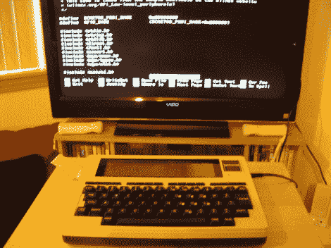

# 树莓派发现自己在一个 TRS-80 模型 100 里面

> 原文：<https://hackaday.com/2012/06/14/raspberry-pi-finds-itself-inside-a-trs-80-model-100/>

这台 TRS-80[100 型比你想象的要强大得多。这是因为[Karl Lunt]把它作为他的树莓 Pi 板的外壳。由于 ARM 供电的设备没有外壳，所以看到像这样的复古选择很有趣。我们不得不出去买一个 USB 键盘来使用我们自己的 RPi，我们很欣赏[Karl]使用原始键盘作为输入设备的解决方案。](http://www.seanet.com/~karllunt/RasPiM100.html)

上面你可以看到他用液晶电视作为显示器。目前，这种连接是通过复合视频输出实现的，这解释了图像模糊的原因。在 TRS-80 的右侧，一个标准的壁式电源插座连接到桶形插孔以提供电源。[Karl]废弃了一个 USB 手机充电器，以便从桶形插孔连接到 Pi 板上的微型 USB 插孔。左边的带状电缆让他不用打开机箱就能接触到 I/O 接头。

为了使用键盘，他用一块小板子把它接了进去。它连接到 RPi 上的 USB 端口，根据从用户那里收到的信息发送 HID 键盘命令。我们喜欢这个选项，因为它给了你预处理击键的能力(例如:你可以编写你自己的自定义宏，让青少年监听)。目前，Model 100 的液晶显示屏还没有连接，但他可能会在未来增加这一功能。