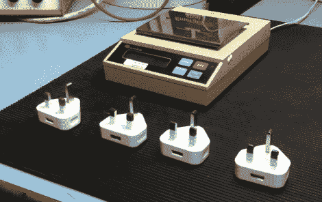

# Raspberry Pi 基金会关注假冒苹果电源

> 原文：<https://hackaday.com/2012/10/10/raspberry-pi-foundation-looks-a-counterfeit-apple-power-supplies/>

树莓派基金会的地位有些独特。他们总是测试返回给他们的单元，希望他们能改进设计。他们经常要求将电源与 RPi 单元一起送回，因为我们知道，如果 PSU 不能提供足够的电流，电路板将无法正常工作。因此，他们能够看到几款假冒的 iPhone 充电器。这不是为 RPi 供电的推荐方式之一，但他们收集故障硬件的能力意味着他们已经识别出市场上三种不同的假货。

这里看到的是一个真正的苹果产品在左边。其他的都是假的，最容易识别它们的方法就是闪亮的铬合金插头。正品零件的连接器表面是哑光的。倒角也有所不同，甚至其中一些 USB 端口的方向也有所不同。不幸的是，我们没有看到里面，而这正是我们真正想要的。但是，您可以在休息后的视频中看到，称重适配器也会让人觉得它是假的，这表明其中的组件可能会有很大差异。这让我们想起了其他一些[被曝光的假 PSUs】。](http://hackaday.com/2012/01/04/exposing-some-fake-electronics-with-too-good-to-be-true-prices/)

[https://www.youtube.com/embed/VL0xTTWG2dI?version=3&rel=1&showsearch=0&showinfo=1&iv_load_policy=1&fs=1&hl=en-US&autohide=2&wmode=transparent](https://www.youtube.com/embed/VL0xTTWG2dI?version=3&rel=1&showsearch=0&showinfo=1&iv_load_policy=1&fs=1&hl=en-US&autohide=2&wmode=transparent)

[谢谢乔]