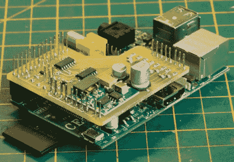

# Raspberry Pi 可以监控你的太阳能设置

> 原文：<https://hackaday.com/2012/07/25/raspberry-pi-keeps-tabs-on-your-solar-power-setup/>

[Brian Dorey]一段时间以来一直在为他的家添加绿色能源解决方案，随着事情的进展，他已经尝试了几种不同的数据记录器迭代。监视他的太阳能系统的最新系统是一个配备了定制的 I2C 模拟/数字转换器的树莓 Pi。

Rasp Pi 负责监控与他的太阳能热水和存储系统相关的几个不同的温度传感器，但这只是开始。它还监视着安装在屋顶的太阳能电池板、电池组和充电控制器。此外，他还监控家里的温度和水箱的再循环泵，因为，为什么不呢？

所有收集到的数据都被传送到他的网络服务器上，在那里显示出来供他阅读和分析。[Brian]在这里发布了他的代码[，所以你可以用同样的方式轻松监控你的家。](https://github.com/briandorey/RaspberryPiSolarLogger)