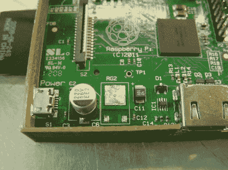

# 树莓 Pi 功率调节器移植降低功耗

> 原文：<https://hackaday.com/2012/06/30/raspberry-pi-power-regulator-transplant-reduces-power-consumption/>

如果你想用主电源转换器以外的东西来运行你的树莓 Pi，并且你有足够的勇气，这款软件正合你的胃口。[Tom]与[一起写了 RPi 的库存线性调节器](http://www.bitwizard.nl/wiki/index.php?title=Reducing_power_consumption_of_a_raspberry_Pi)的开关模式电源替换。这是我们第一次看到 RPi 的板载硬件被改动，这是事情变得有点可怕的地方。

首先要做的是移除线性调节器，留下上面看到的未填充的 RG2 足迹。显然，返工站是不可用的，因为他们使用的技术描述了通过用镊子夹住调节器来举起电路板，然后用热风枪吹它。这让我们有点不安，因为处理器芯片有一个你不想弄乱的焊接足迹。

但显然一切都很好。随着浪费的线性稳压器的消失，一对 5v 和 3.3V 开关稳压器通过 GPIO 头注入电压。初步测试显示节省了大约 25%,但我们认为这可能会因负载不同而有很大差异。