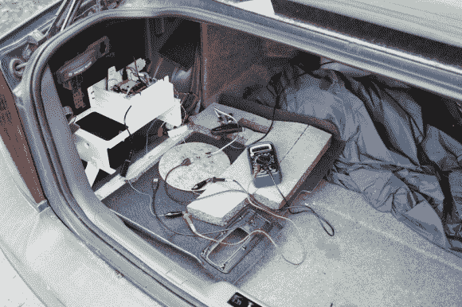

# 树莓派取代了沃尔沃的导航系统

> 原文：<https://hackaday.com/2013/06/17/raspberry-pi-replaces-a-volvo-nav-system/>

[Reinis]有一辆沃尔沃 S80。它包括的仪表板功能之一是一个 6.5 英寸的液晶显示屏，它可以作为导航系统使用。问题是沃尔沃大约五年前就停止为它制作地图了，而且根本没有他所居住的拉脱维亚的地图。所以它毫无价值…对你这样的普通司机来说。但是[Reinis]正在通过用树莓酱替换系统来自己修复它。

该链接指向他的项目概述页面。但是他已经发布了后续的[硬件设计](http://wot.lv/carpc-build-part-1-hardware.html)和[初始测试](http://wot.lv/carpc-build-part-2-hardware-still.html)。他的设计基于一个 Raspberry Pi 板，但它没有与汽车系统通信所需的所有硬件。为此，他设计了自己的屏蔽，使用 ATmega328 以及 CAN 控制器和 CAN 收发器。后两个芯片插入汽车车载诊断系统的 CAN 总线。我们没有看到太多的布线，但概述帖子提到，屏幕采用 RGB 或复合输入，所以他必须从后备箱到仪表板运行复合视频电缆。