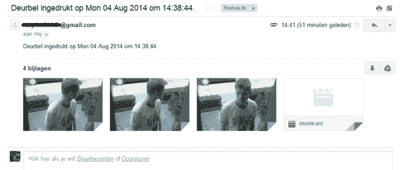

# 树莓派在你家前门偷窥

> 原文：<https://hackaday.com/2014/08/06/raspberry-pi-spies-on-your-front-door/>

桑德的第一个树莓 Pi 项目是让它向他的 iPhone 发送信息。在此基础上，他决定更进一步，将微型电脑连接到他的门铃上，创建一个系统，只要有人在前门，就可以向他的手机发送推送消息。

[Sander]的门铃是无线的，他决定保留其所有原始功能。向 Pi 发出信号所需要的只是一个简单的电路，它与门铃的状态 LED 相连，只要按下门铃，LED 就会关闭。

Raspberry Pi 运行一个 python 程序来处理连接到门铃的 GPIO 引脚。当门铃被按下时，该程序处理并发送推送通知，同时用附加的网络摄像头为访客拍照。照片包含在消息中，因此[Sander]可以看到谁在前门。该项目的代码包含在他的项目页面上。

这个项目给我们敲响了警钟，因为我们已经看到了使用 Raspberry Pi 和推送通知的项目。到目前为止，它们都没有包含网络摄像头或利用现有的无线门铃，这是一个很大的进步！