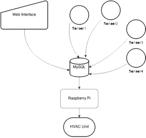

# Raspberry PiPhone 恒温器监控你的整个房子——或者至少这是计划

> 原文：<https://hackaday.com/2014/12/06/raspberry-piphone-thermostat-monitors-your-entire-house-or-at-least-thats-the-plan/>

[杰夫·麦吉赫]或者他喜欢如何被人知道，[Nooganeer]刚刚完成了他研究生毕业后的第一个大型技术项目。这是一个联网的恒温器，利用了他的旧 iPhone 4 和一个树莓派。

自从(Nooganeer)在 2014 年春天和他的妻子买下他的第一栋房子以来，他就一直有一个强烈的梦想，那就是将家庭自动化添加到每一个电器中。正如他所说…

> 家庭自动化一直是我的兴趣所在。如果我不用担心开关，也不用担心它们处于什么状态，我会节省多少时间和烦恼？我家的效率会提高多少？总是知道我家里每个电力消费者的状态，然后还能够记录和分析这些数据，这不是很酷吗？

他的第一个挑战是制造一个智能恒温器——毕竟，加热和冷却你的房子通常需要最多的能量。在他认为树莓是他系统中最好的大脑之前，他用过树莓皮。在对 HVAC 布线做了一些研究后，[Nooganeer]决定采用 Makeatronics 固态继电器板来控制 HVAC。这使得他可以在 Raspberry Pi 上使用 GPIO 来控制炉子和空调设备。

现在，大多数恒温器只使用一个温度传感器来  确定温度——因为他有一个树莓派，他想用 Spark Core 套件在几个房间增加温度传感器！他使用的软件是用 Python 编写的，用于可视化，他使用 MySQL 数据库来收集分析数据。

它连接到网络上，便于他在任何地方进行监控，因为他身边有一部 iPhone 4，他决定用它作为恒温器的显示屏。他的博客上有大量关于他如何创造这种设备的信息，他希望及时为人们发布更深入的教程，这样他们也可以连接他们的家。

下一步，他计划将湿度、光线和运动传感器集成到小型无线包中，放置在房子周围。也许他还会添加[一个无线插座……](http://hackaday.com/2013/01/31/getting-an-arduino-to-control-a-wireless-outlet/)