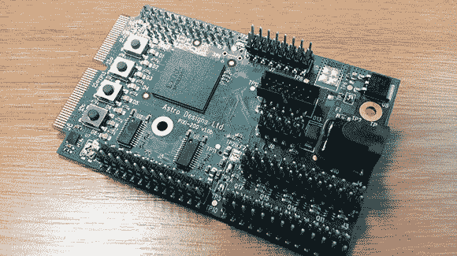

# 拉斯皮天体摄影委员会还做其他一切事情

> 原文：<https://hackaday.com/2013/01/17/raspi-astrophotography-board-also-does-everything-else/>

几年前，Astro Designs 的人组装了一个电路板，从傻瓜相机上取下现成的 CCD 传感器，并将其转化为令人尊敬的天文摄影传感器。从那以后，世界上出现了 Raspberry Pis、Arduinos 和其他微控制器平台的爆炸式增长，这使得这成为硬件修订的完美时机。

他们的 [PiXi-200](http://www.astro-designs.com/page14.php) 像他们以前的 AstroCam 板一样，能够将图像传感器从相机中取出，并将其变成望远镜安装的相机。然而，这只是它的一个技巧:PiXi-200 还具有加速度计、陀螺仪、足够做任何事情的 UARTs、四通道 ADC 和四通道 DAC、24 个 GPIO 引脚、足够用于任何项目的 led 和按钮，以及 20 万门 FPGA。所有这些都在一个直接插入 Raspberry Pi GPIO 引脚的电路板上，就像一个 Arduino 保护罩。不用说，你可以在这块板上做很多事情。

目前，该设计仍处于原型阶段，但一旦一切都最终确定下来，该板的基本模型将售价 30 英镑(50 美元)。高端的“C 型”主板，带有所有的铃铛和哨子，售价为 45 GPB(70 美元)。