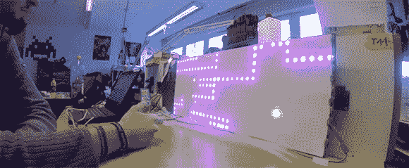

# Raspi 控制的 RGB LED 条形显示器

> 原文：<https://hackaday.com/2013/01/23/raspi-controlled-rgb-led-strip-display/>

[4RM4]去年 12 月，在斯图加特 hackerspace Shackspace 参加第 29 届混沌通信大会时，遇到了一个卖可单独寻址的 RGB LED 灯的家伙。他带着一个树莓派，经过一点点工作后，他组装了一个 LED 显示屏，包裹在一个垃圾桶周围。一个体面的黑客，但还没有准备好黄金时间。

回到窝棚之后，[4RM4] [决定走一个更经典的方向](http://shackspace.de/?p=3826)建造一个 RGB 蛇克隆体。实现了一些简洁的功能，比如高分列表、免费游戏机器人和时钟。

为了控制他的贪吃像素的蛇，[4RM4]使用了一个 Wii 双截棍控制器，连接到树莓 Pi 的 GPIO 引脚。这看起来很有趣，鉴于休息后视频中显示的高得离谱的分数，看起来这个建筑在 Shackspace 得到了很多使用。

[https://www.youtube.com/embed/NO47IX9lz-s?version=3&rel=1&showsearch=0&showinfo=1&iv_load_policy=1&fs=1&hl=en-US&autohide=2&wmode=transparent](https://www.youtube.com/embed/NO47IX9lz-s?version=3&rel=1&showsearch=0&showinfo=1&iv_load_policy=1&fs=1&hl=en-US&autohide=2&wmode=transparent)