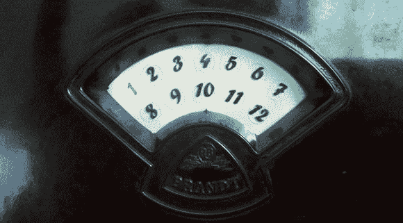

# 带谷歌音乐的 Raspi 网络电台

> 原文：<https://hackaday.com/2013/06/04/raspi-internet-radio-with-google-music/>

这不是他的第一个网络收音机，但[Matthias]' [经典胶木收音机的现代化](http://syd711.github.io/mephisto_ii/)是一件真正的功能艺术品。它不仅保留了旧收音机的外观，还可以通过互联网收听流媒体和他的整个 MP3 收藏。

对于软件，[马提亚斯]使用 jquery 下载网络电台流，并很快就知道如何通过谷歌音乐播放他所有的 MP3。这一点，以及他的移动设备的网络遥控器，让这个新的老派网络电台能够播放(马提亚斯)想听的任何东西。

收音机的控制是旋转编码器，由一个真正神奇的 LED 显示屏(见上图)提供指示，取代了 70 年前的调谐盘。这些数字既表示当前的谷歌音乐播放列表，也表示当前正在播放的互联网流，这取决于选择器旋钮所处的模式。

这是一件漂亮的作品，旋钮和转盘看起来像是来自一台真正的 70 年前的收音机。在我们看来这是一个胜利。