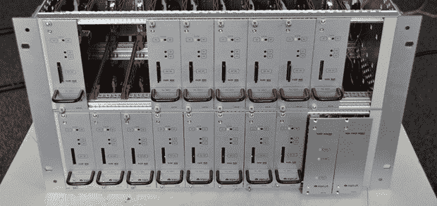

# Raspis 和 Arduinos 支持 FM 广播流

> 原文：<https://hackaday.com/2013/11/20/raspis-and-arduinos-for-fm-broadcast-streaming/>

葡萄牙最大的互联网提供商需要一个系统来将安哥拉、Cabo 佛得角和莫桑比克的调频广播电台转换为网络流。像每一个好项目一样，[负责工程的人转向了 Hackaday staples](http://artica.cc/blog/2013/11/07/fm-stream-tech-report.html)——Raspberry pi、Arduinos 和 TP-Link 路由器，所有这些都被塞进了一个令人敬畏的模块化机架装配柜中

这个巨大的机架安装系统中的每个模块都包括一个 Arduino、一个 Raspberry Pi、 [Silicon Labs Si4705](http://www.silabs.com/products/audio/fmreceivers/Pages/si470405.aspx) FM 接收器芯片和一个 TI USB 音频捕获芯片，该芯片允许 Pi 将来自无线电接收器的音频转换为音频流。所有 pi 都连接到一个 24 端口以太网交换机和一个单独的主 Raspi，该主 Raspi 将从每个模块接收的数据转换为 icecast 流。

每个模块背后的工程设计令人印象深刻，它们都是热插拔的，具有远程关机功能，并且背板上有分压器，可以检测它在机架中的位置。这是一项非常酷的工程，也是一个非常酷的例子，利用现成的硬件来做一些可能非常非常困难的事情。