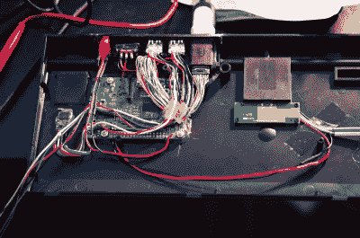

# 称为 Kiiboard 的 raspi/Keyboard 项目，仍读作“Keyboard”

> 原文：<https://hackaday.com/2015/03/21/rasppikeyboard-project-called-kiiboard-still-pronounced-keyboard/>

[b10nik]来信告诉我们他刚刚完成的一个非常好的项目。它是一个机械[键盘，内部集成了树莓 Pi 2](http://sneek.co/blog/project-kiiboard/) Model B。

[b10nik]专门为这个项目购买了一个新的[Filco Ninja maje touch-2](http://www.keyboardco.com/keyboard/swedish-finnish-filco-ninja-majestouch-2-tenkeyless-nkr-tactile-action-keyboard.asp)键盘。虽然这可能会让一些人畏缩，但为了给树莓派找到一个开放的腔体，键盘立即被拆开了。幸运的是，键盘盒的左后方有足够的空间。

如果你熟悉 Raspberry Pi 2 型，你会知道所有的连接都不在电路板的同一侧。USB、音频、HDMI 和以太网插孔已从 PCB 上移除。以太网端口是不需要的，因为这个黑客使用 WiFi，但那些其他端口被扩展并终止于一个定制的 3D 打印 I/O 面板。库存键盘外壳必须进行切割，以适应新面板，从而形成非常干净的外观。

这款键盘的袖子上还有一个小技巧，它可以与内置的 Raspberry Pi 一起使用，也可以用作标准键盘。这是通过 FSUSB30MUX USB 开关 IC 完成的，它将 Raspberry Pi 与键盘的 USB 输出完全断开。

对于另一个 RaspPi/键盘解决方案，请使用 Cherry G80-3000 机械键盘查看几年前的这个概念。