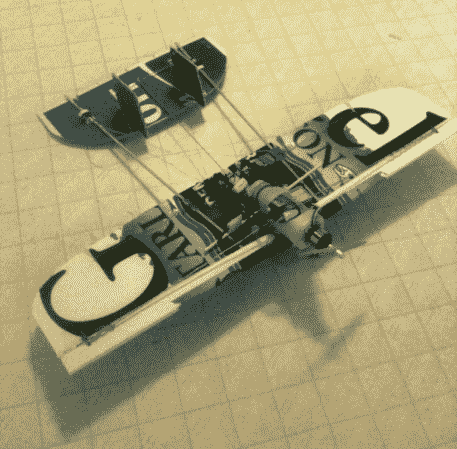

# 政治标志制成的遥控飞机

> 原文：<https://hackaday.com/2012/10/27/rc-airplane-made-from-political-signs/>

无论你支持哪个候选人(如果有的话)，我们可以打赌，你可能已经厌倦了到处看到广告和政治标志。[马克]写了一个黑客程序，允许你实际上[使用这些标志做一些有趣的事情](http://snackeyes.blogspot.com/2012/10/coroplast-political-sign-twin-boom-rc.html "RC airplane from political sign")，制作一架遥控飞机！

[Mark]在他的文章中给出了完整的材料清单，但主要部分是活动标志。今天不是律师日，所以我们不确定服用它们的合法性。至少在选举日之后，很难说会有人在乎。当然，你还需要一个马达，道具和遥控装置，以及一些销钉来把尾部固定在机身上，所以不要买“运动承诺”说这是一架免费的飞机。

CAD 图可用的切块，以及如何切割标志，形成没有任何其他部分的铰链。这是非常聪明的，在网站上可以看到一个在桌子上飞机运行的视频。根据[马克]的说法，没有视频在它的试飞中滚动，但它确实在一些干扰使飞机着陆之前飞行了。希望他能很快得到一些它的动作镜头！