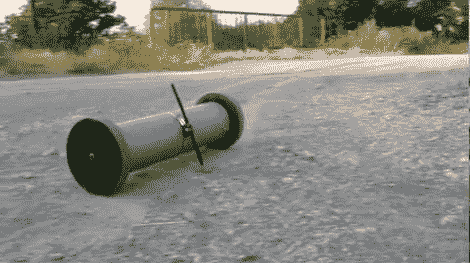

# 遥控 PVC 机器人

> 原文：<https://hackaday.com/2012/07/19/rc-pvc-bot/>

这根 PVC 管是由无线电控制的。末端的轮子提供了运动，但如果不是因为绑在管子中心的小尾巴，它不会去任何地方。

当马达转动时，机器人的身体需要一些东西来推动。在这种情况下，尾部撞击地面，防止底盘旋转。我们已经看到有人试图通过使用不平衡的轮子来提供角动量来实现没有尾巴的航行，但是这种方法更加可靠。

机器人的控制器是从一辆玩具遥控汽车上拆下来的。一旦连接到齿轮马达上，它就可以开始转动了。建造的真正困难在于把所有的东西都装进管子里。一个框架是由几个圆盘组成的，这些圆盘用作安装平台，用螺纹杆隔开。休息之后，在视频中看到它绕过一条砾石路。

[https://www.youtube.com/embed/8IBA5qpTTaE?version=3&rel=1&showsearch=0&showinfo=1&iv_load_policy=1&fs=1&hl=en-US&autohide=2&wmode=transparent](https://www.youtube.com/embed/8IBA5qpTTaE?version=3&rel=1&showsearch=0&showinfo=1&iv_load_policy=1&fs=1&hl=en-US&autohide=2&wmode=transparent)

[via [被黑的小工具](http://hackedgadgets.com/2012/07/07/remote-control-pvc-pipe/)