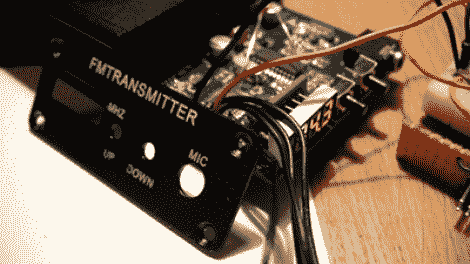

# 重新设计一些调频发射机固件

> 原文：<https://hackaday.com/2012/07/16/re-engineering-some-fm-transmitter-firmware/>

[furteck]用他在易贝买的这个调频发射机进行了一次小小的冒险。它工作正常，但他希望能够扫描频率，并在电源循环后让设备返回到相同的设置。他打开它，开始努力实现他所有的目标。

该设备由 ATmega48 驱动，板上有一个 6 引脚 ISP 接头。芯片的初始读数不起作用，他很快发现不稳定的电源是罪魁祸首。连接他自己的调节源后，他可以顺利地读取芯片 id，但代码被锁定，所以不可能转储。幸运的是，他设法找到了电路板，并在他的报告中包含了完整的原理图。有了这个，他删除了芯片，并开始从头开始编写自己的固件。

休息后的视频展示了完成的项目。他现在可以通过音频反馈扫描频率，让他知道何时找到要劫持的电台。新代码还会将调谐的电台写入 EEPROM，以便下次钻机通电时使用。

[https://www.youtube.com/embed/ZhKmHAO0Wmc?version=3&rel=1&showsearch=0&showinfo=1&iv_load_policy=1&fs=1&hl=en-US&autohide=2&wmode=transparent](https://www.youtube.com/embed/ZhKmHAO0Wmc?version=3&rel=1&showsearch=0&showinfo=1&iv_load_policy=1&fs=1&hl=en-US&autohide=2&wmode=transparent)