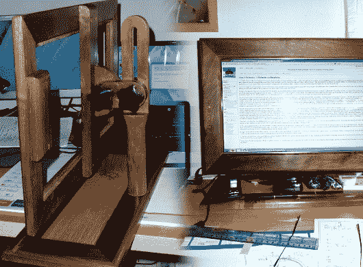

# 重新利用旧的笔记本电脑显示器

> 原文：<https://hackaday.com/2013/12/26/re-purposing-an-old-laptop-display/>

 【蒂姆】发现自己有一台 18.4 英寸屏幕的笔记本电脑，但在其他方面运行不正常。扔掉它太可惜了，所以他决定通过[把它变成一个独立的显示器](http://floatingwombat.me.uk/dokuwiki/doku.php?id=projects:frankenmonitor)来挽救这个屏幕。这并不新鲜，因为他做了许多人做过的事情，并向易贝寻求售后液晶控制板。真正的美在他建造的围墙里。[Tim]从以前的项目中得到了一些废木料，所以他开始为显示器设计一个新框架，以及一个非常漂亮的可调节支架，如上图所示。

一个很好的细节是在控制面板按钮。LCD 控制器配有一个单独的控制电路板，虽然他最初安装它时犯了一个错误，但他最终得到了一套与框架完美匹配的橡木按钮。然后，他用苯乙烯做了一个很好的背衬，既能固定屏幕，又能容纳电子设备。

总的来说，这是一个看起来不错的项目，看到电子产品被重新利用而不是被扔进垃圾填埋场总是令人高兴的。我们不禁认为，这将是一个很好的框架，可以用来制作相框或壁挂式电脑。