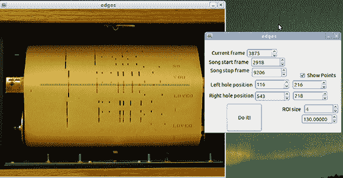

# 在没有钢琴演奏器的情况下阅读钢琴卷帘窗

> 原文：<https://hackaday.com/2013/01/07/reading-piano-rolls-without-a-player-piano/>

不久前，[雅各布]用一架自动钢琴四处演奏。在将一个纸卷放入机器并试图弄清楚一台使用百年老技术的五十年老机器如何复制一个熟练的钢琴家后，他决定自己尝试解码钢琴纸卷。他想出了一个巧妙的方法，在圣诞节假期使用一台相机和一些 OpenCV。

钢琴演奏者的老派机械使用风箱和阀门系统通过几十个孔吸入空气，每当钢琴卷上出现一个孔时，动作就会碰到一根弦。为了将这种机制带入现代，[Jacob]将一台摄像机对准钢琴卷的活跃部分，并使用 [OpenCV](http://opencv.willowgarage.com/wiki/) 将一张纸上的洞翻译成 MIDI 文件。

合成的版本听起来和原始的纸质卷轴版本一样好，正如在休息后的视频中看到的那样。视频中有一些同步问题，产生的 MIDI 文件没有正确的调，但这很容易被任何愿意复制这个项目的人修复。

[https://www.youtube.com/embed/lXECSFnu9yg?version=3&rel=1&showsearch=0&showinfo=1&iv_load_policy=1&fs=1&hl=en-US&autohide=2&wmode=transparent](https://www.youtube.com/embed/lXECSFnu9yg?version=3&rel=1&showsearch=0&showinfo=1&iv_load_policy=1&fs=1&hl=en-US&autohide=2&wmode=transparent)