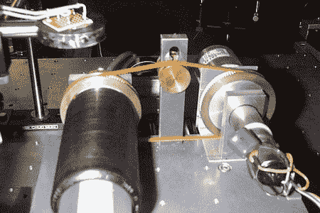

# 用激光读取蜡筒

> 原文：<https://hackaday.com/2012/05/27/reading-wax-cylinders-with-lasers/>

从 1902 年到 1905 年，波兰人类学家 Bronislow Pilsudski 在日本北海道的蜡筒上做了一系列的记录。北海道大学的研究人员一直在研究在不对凹槽造成任何进一步损坏的情况下读取圆柱体的方法。他们的首选方法是使用反射激光。他们有一篇很短的关于配置的文章，但应该足以让你了解他们的想法。

他们承担的另一个项目是阅读原始模型。他们不得不完全重新配置他们的设备，以便能够插入圆柱体。不过，他们从中获得的质量要好得多。