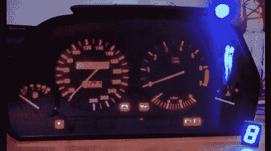

# 真正的宝马赛车游戏集群

> 原文：<https://hackaday.com/2012/04/20/real-bmw-dash-cluster-for-your-racing-games/>

这里有一个很酷的附加功能，可以让赛车游戏变得更有吸引力。一个真正的仪表组怎么样？[Herctrap]已经[写好了原理图，并分享了代码](http://www.arduino.cc/cgi-bin/yabb2/YaBB.pl?num=1284042428)以从 x-sim 驱动一辆真实汽车的仪表组。这是一种与我们之前见过的中的[略有不同的方法，但并不太复杂。虽然这仍然只是他桌上的另一个配件，但它似乎真的为游戏增加了相当多的反馈。接下来，他需要为他的座位建造一个运动平台！](http://hackaday.com/2012/01/29/simulated-dashboard-for-a-simulated-race/)

[https://www.youtube.com/embed/y0aSG55CtcI?version=3&rel=1&showsearch=0&showinfo=1&iv_load_policy=1&fs=1&hl=en-US&autohide=2&wmode=transparent](https://www.youtube.com/embed/y0aSG55CtcI?version=3&rel=1&showsearch=0&showinfo=1&iv_load_policy=1&fs=1&hl=en-US&autohide=2&wmode=transparent)