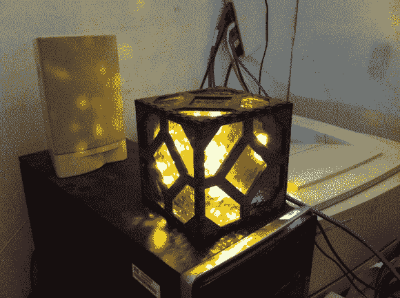

# 现实生活中 Raspi 控制的红石灯

> 原文：<https://hackaday.com/2013/11/16/real-life-raspi-controlled-redstone-lamp/>

《我的世界》的狂热分子一直在寻找令人印象深刻的方法将 8 位组件带入现实世界，雷石东灯复制品也不例外。[Chris]不仅想复制这个方块，还想通过控制游戏中立方体被点亮时的发光效果来扩展他与游戏世界的联系。

这盏灯是 hive 76(T1)的一伙人的产品，他们合作开发了一个快速原型，使用了《我的世界》Python 客户端 [pyCraft](http://github.com/x56/pyCraft) ，一个 Arduino，一个晶体管和一个临时 papercraft 灯模型。Hive76 成员[Kyle]参与编写 pyCraft 的插件，该插件监听开/关消息并相应地设置 RasPi 的一个 GPIO 引脚。实际灯的硬件被设计成使 8 位质量变得更加精确。结果是激光切割的中密度纤维板，上面层压了斑马木单板。内部用琥珀大教堂玻璃完成，然后立方体的侧面粘在一起。RasPi，印刷电路板和发光二极管适合里面，所有贴合在一起。

切换到 Hive76 项目页面以获得更多细节和插件链接，并查看下面的视频演示。对于另一个受《我的世界》启发的现实生活项目，请查看[【比尔】在蝙蝠箱](http://hackaday.com/2013/08/13/the-batbox-portable-power-polished-and-professional-plus-smoke/)中的表演。

[https://www.youtube.com/embed/exuRz-lJywU?version=3&rel=1&showsearch=0&showinfo=1&iv_load_policy=1&fs=1&hl=en-US&autohide=2&wmode=transparent](https://www.youtube.com/embed/exuRz-lJywU?version=3&rel=1&showsearch=0&showinfo=1&iv_load_policy=1&fs=1&hl=en-US&autohide=2&wmode=transparent)