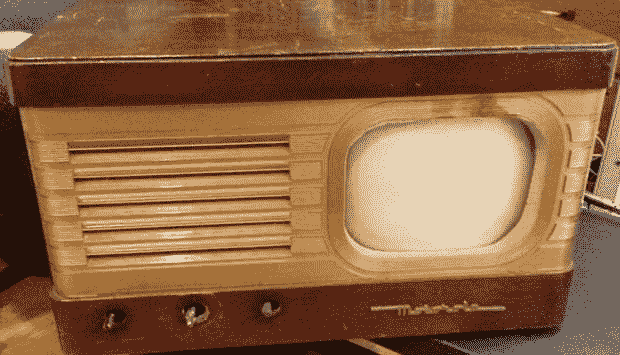

# 重建一台 20 世纪 40 年代的电视机

> 原文：<https://hackaday.com/2013/10/18/rebuilding-a-1940s-tv/>

在古董店成堆的垃圾下可以找到很多很酷的东西。[dijt]发现了这一点，当时他在一堆早期的小饰品下发现了一台 20 世纪 40 年代的 7 英寸摩托罗拉电视机。我们可以理解[dijt]的冲动购买，而重建这台古老电视的尝试不仅仅是一次黑客行为。

如果你知道去哪里找，从电气时代的黎明到现代，有数百种资源可用于旧电视、高保真音响和无线电设备。在咨询了一些论坛后，[dijt]拿到了他的电视机的原理图，并开始诊断它的问题。

原来这一套中原来的镇流管早就死了。幸运的是，这是旧电视的一个常见问题，在咨询了一些论坛后，[dijt]有一个原理图，用一些新的电容和电阻替换这个镇流器管。

在构建好电路并进行测试后，[dijt]将其安装在旧的镇流器管中，以复制 1949 年电视机的原始外观和感觉。有趣的是，这是这台电视第二次被修复；20 世纪 60 年代的电容和电阻告诉[djit]这台电视曾经去过电视维修店。让我们只希望[djit]这次记得把原理图粘在机箱里面。