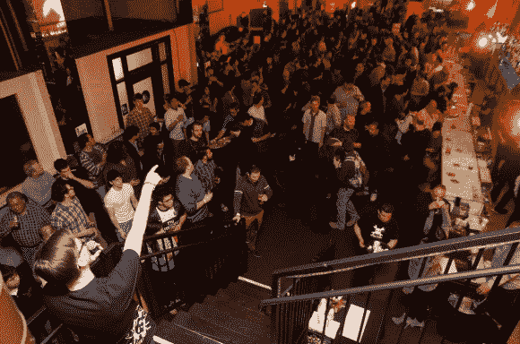
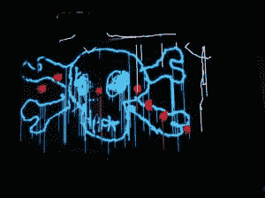
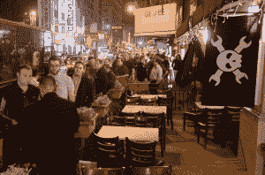
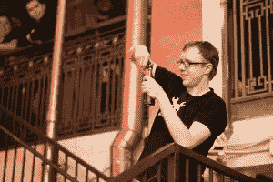
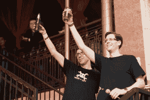
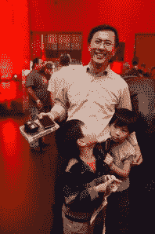
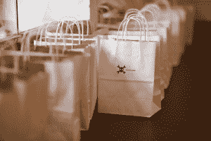
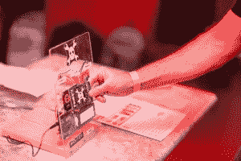

# 回顾:Hackaday 的首次现场活动

> 原文：<https://hackaday.com/2014/01/27/recap-hackadays-first-live-event/>

上周二，我第一次知道 Hackaday 举办了我们自己的现场活动。有一些与会议之类的事情相关的不太正式的聚会。但是我们举办了这个聚会，看看读者们是否会为了一个相互交流的机会而离开他们的巢穴。我们打了电话，你接了，我过得很愉快。Hackaday 挤满了四百多名读者，我的每一次谈话都以一次迷人的互动而告终。谢谢大家！

[![[Brian], [Eliot], and [Mike] via [Mike's] phone an color corrected by [Hefto](img/e956bd17c05a8b8be49b46412677131d.png)](http://hackaday.com/wp-content/uploads/2014/01/color-corrected-brian-eliot-mike.jpg) 

【布莱恩】【艾略特】和【迈克】通过【迈克的】电话一个被【Hefto

【布莱恩·本奇夫】修正过的颜色，第二天早上我回到了我们白雪皑皑的家园。令人惊讶的是，这是我们第一次见面，尽管过去几年我们在 Hackaday 上密切合作。我也有幸第一次见到了(埃利奥特·菲利普斯)和(杰克·巴芬顿)。很抱歉我没有更多的时间和他们在一起，但是当你试图和几百个人打招呼的时候，你必须继续前进。

在我变得太罗嗦之前，我最好把更多的标签扔在这里。跳伞后，请和我一起详细了解我们所做的事情，我脑海中突出的内容，以及我们接下来要去哪里。

### 我们做了什么

我们租出了洛杉矶酿酒公司，强迫员工整晚穿休闲服。然后玩得很开心。你期望什么？

 

在激光涂鸦中徒手画出的快乐扳手【汤姆·米克斯通过脸书拍摄】

读者提前 90 分钟开始出现并不令人惊讶。我遇到的第一位绅士以真正友好的黑客方式走进来，问他是否能帮忙设置。好极了。尽管我紧张不安，但这个地方已经为下午 6 点的开放做好了准备。[Ben Delarre]按时安装了他的激光涂鸦设备。我们曾设想过一个巨大的光秃秃的墙作为投影面，但实际上在任何酒吧都不存在，所以我们用一个较小的投影屏幕来凑合。这仍然很有趣。[布赖恩]找到了一个地方乔利扳手旗这是他自己做的东西。它挂在建筑物前面的遮阳篷上。我试图自杀，把海报挂在一个有点太短的梯子上。负责协调一切的[萝莉]安排好了登机区域，行李也放好了。

 显然是花了很长时间才进门。我要责怪那个检查身份证的家伙，因为我认为我们已经做好了扫描车票或快速查找姓名的准备。但是到了 7:15，大多数人都进去了。至少等啤酒的时间不会很长，这弥补了在门口的耽搁。我们让群众安静下来，在通往阁楼的楼梯上清理出一个平台，这样我就可以开始正式讲话了。这个演讲包括了我们要去哪里的信息(见下文)，但是用几个简短的演讲来打断它还是不错的。  【布莱恩】谈到了[哈都伊诺](http://hackaday.com/HaDuino/)；在破之前打开了差不多一瓶啤酒。[Ben]谈到了组装激光 Grafitti 的试验；他构建了一个很棒的控制器，但缺失的源代码是一个试验，也是未来帖子的主题。和[CharlieX]和他的妻子[Kris]，都与洛杉矶的[NullSpaceLabs 有关，谈到了以前和未来的 LayerOne 会议徽章硬件。](http://hackaday.com/2014/01/20/touring-null-space-labs-another-la-hackerspace/)

 我们为 Hackaday 的概念举杯，然后继续享受生活。这个地方一直都很满，直到我们不得不搬出去。晚上 10 点以后的某个时候。我设法摆脱宿醉。因为我和很多人聊天，所以我没有太多机会去拜访调酒师。事实上，我从来没有去阁楼尝试过激光涂鸦，对此我有点失望。下一次，我们可能不得不计划组装我们自己的大屏幕投影屏幕

### 有什么突出的

[![[CharlieX] gives a closer look at LayerOne Badge hardware](img/64412ae877015ca5a4702a0503018689.png)](http://hackaday.com/wp-content/uploads/2014/01/01-21-2014_194850.jpg)

【CharlieX】细看 LayerOne 徽章硬件

我从这甚至最大的收获就是读者想帮忙。从提前 90 分钟出现的人到主动提出为人类解释合成孔径雷达的客座博文的国防工业编码员，每个人似乎都很乐意参与进来，让 Hackaday 变得更棒。我们开始吧！这真的是虚拟黑客空间的缩影。人们尽其所能贡献他们的专业知识和时间，我们都庆祝成功，并试图克服任何不足。这并不意味着我们必须住在同一个地方，但像这样的现场活动确实传达了这样一个信息，即我们在这里所做的事情是所有人都喜欢的。

**人与人之间是积极的。从评论来看，你可能会想到聚会上会爆发激烈的争论。但这些我都没有经历过。事实上，有一位与会者正在分发“网络巨魔”的名片，他似乎是这群人中最令人愉快的一个。**

 **时代跨度几代。**有些客人看起来只有 6 岁，有些已经退休，他们一定是把黑客变成了有趣的全职“工作”。

我们有自己的粉丝，这没关系。实际上，有人告诉我，他们只看我写的东西，不喜欢其他作家写的东西。幸运的是我没有得到相反的结果。但是有一点我总是喜欢指出…这不是关于我或者其他员工的。 **Hackaday 是关于社区的。**

### 我们接下来要去哪里

这是一个字面和比喻的问题。黑客日正在增长，所以“我们要去哪里？”是一个非常重要的问题。新面孔、客座博文形式的新内容以及现场活动的增加可能会让一些长期读者感到困扰。但是这个博客是从底层发展起来的。每个作为贡献者被带来的人都是长期读者。这是我们的核心价值观之一。我们都不想看到令人敬畏的东西消失，我们每天都在关注地平线，以确保我们保持在正确的轨道上，同时覆盖新的黑客。

Bags to carry free stuff home

在我们的每周轮换中包含原创内容的机会是一个受欢迎的补充。这有助于确保我们不会停滞不前，当然也增加了我们所提供的价值。但仔细分析会发现，我们一直坚持一个严格的目标，即每天至少发布六篇粗糙的文章(其中大部分来自读者)，为原创内容和新闻帖子留出大约两个位置(就像这篇文章)。我们希望这是一个让那些不想看到任何改变的人满意的政策。

我们有一些从未有过的机会。虽然我们一直在做很多事情，但我准备讨论的唯一一件事也在会上透露了。[Brian Benchoff]对困难、昂贵、耗时且不太可能盈利的黑客有一些宏伟的想法。以这样或那样的方式描述你认为很棒的每一个项目。[Brian]别担心，我只是透露一下你的一项努力:绕线 68000 计算机。他在 12 月把董事会文件送到 Seeed 工作室，他们回来了。在参观 Apex 电子公司时，他为这个项目买了一堆绕线插座和其他有趣的小玩意。它是为一个案例设计的，初步的照片(我认为他故意把有趣的照片弄得模糊不清，以此来激怒我)非常值得一看。你认为把整个复古电脑用电线包起来是个大工程吗？与他手头的其他一些东西相比，这根本不算什么。

### 说真的，我不能去。下一个在哪里？

Using NFC cards to vote on the next live event (more on this in another post)

真的很难说下一个会在哪里。我们用这个来测试 Hackaday 社区是否真的会出现，而你出现了！聚会很棒，但是如果我们要麻烦地把人们聚在一起，我更喜欢做一些黑客工作。第一次黑客活动很可能会再次在洛杉矶举行——作为第一次试运行。但是如果我们能把这些带到其他城市，我们会的。

至于拓展业务，对我来说最有意义的是去美国另一个人口密集的中心:纽约。在那之后，在中部做些事情会很棒，比如芝加哥，或者德克萨斯的某个地方。当然，在欧洲有一些也是很棒的。但是我们还没有侵入我们自己的印钞系统，所以这是一个很大的梦想——我们不怕这样做。

这里有个问题问你。组织这些活动可能需要很长时间。你希望我们在其他活动期间组织更多自发的聚会吗？例如，让一些黑客日员工计划在 DEFCON 期间在酒吧见面？即使你不得不自己买啤酒，你也会过来一起玩吗？

[图片由[爱德华·德·拉·托雷](http://www.edltphoto.com/)拍摄，除非另有说明]