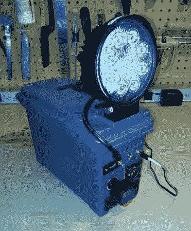

# 充电工作灯照亮你的夜晚

> 原文：<https://hackaday.com/2014/05/04/rechargeable-work-lamp-brightens-your-night/>

我们大多数修补匠都会在某个时候发现自己在偏远地区需要电力。无绳工具是一种选择，但如果你需要更多呢？[Garage Monkey San]着手解决这个问题，它创造了一个[便携式发电站](http://www.instructables.com/id/Portable-Sun-Rechargeable-Work-Lamp/)，它有机载交流电源插座、12v 和 5v 直流输出以及一个集成的聚光灯。

这个项目被安置在一个塑料弹药箱里，这个弹药箱足够大，可以容纳所有必要的部件，并且有一个方便携带的把手。12v 直流密封铅酸电池电源由汽车电池浮充保持充满。光线由安装在外壳顶部的 LED 越野雾灯提供，该灯耗电量小，可确保较长的电池寿命。在这一点上，一个简单的添加是一个 12v 汽车配件插座，这只会增加项目的多功能性。

有了 12vdc 储能，充电和照明都不碍事【车库猴三】决定加一些交流插座。从拆卸现成的 DC 到交流逆变器开始，交流输出线被延长并齐平安装在弹药盒中。该逆变器也碰巧有一个 USB 端口，以便扩展到安装在外壳上，以防你的手机需要在工作现场充电。

[https://www.youtube.com/embed/zUTWq7TubV0?version=3&rel=1&showsearch=0&showinfo=1&iv_load_policy=1&fs=1&hl=en-US&autohide=2&wmode=transparent](https://www.youtube.com/embed/zUTWq7TubV0?version=3&rel=1&showsearch=0&showinfo=1&iv_load_policy=1&fs=1&hl=en-US&autohide=2&wmode=transparent)