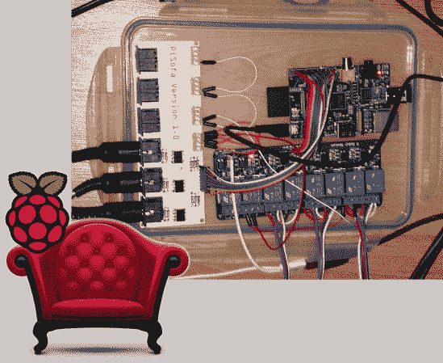

# 躺椅沙发赋予了 Pi 的力量

> 原文：<https://hackaday.com/2014/01/04/recliner-sofa-given-the-power-of-the-pi/>

如果你现在去买一个沙发，迎接你的不仅仅是一个或多个躺椅位置的选择，而是一个完全现代化的单元，配有电动躺椅。对于[Nicki]和[Kevin]来说，这显然不够方便，他们想通过智能手机而不是家具侧面的物理界面(按钮)来控制这项功能。结果就是皮索法，一个树莓皮在继电器板的帮助下连接到家具的电子设备上。

这肯定是一次黑客攻击，但毫无疑问是一次非常巧妙的攻击。看看那个白色的印刷电路板。没错，这是一个工厂纺板，以保持东西漂亮整洁。他们采用了我们最喜欢的一个技巧，把所有东西都放在一个食物储存容器里。经过一些 Ruby 编码，Pi 现在已经完全控制了 sofa。我们没有夸大其词。这实际上是控制它的唯一方法，因为原来的按钮不再工作。但没关系，事实证明它不仅适用于他们的智能手机，也适用于(凯文的)Pebble 手表。

我们想不出任何专门针对沙发的黑客攻击。但是这里有一个吊床，你可以在街上驾驶它。