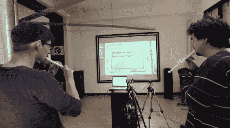

# 在诺基亚 6110 上玩的记录器控制的蛇游戏

> 原文：<https://hackaday.com/2012/04/03/recorder-controlled-snake-game-played-on-a-nokia-6110/>

找出一部旧手机，去一元店买些塑料录音机，然后[为你的下一次聚会制作这个声控贪吃蛇游戏](http://vimeo.com/39492730)。这个项目对于那些熟悉微控制器的人来说是小菜一碟，如果你想尝试你的第一个 Arduino 项目，这将是一个很好的学习经历。

[拉斯洛]和他的朋友称这个项目为耍蛇人。如跳跃后的剪辑所示，它使用音符来指引经典手机游戏《贪吃蛇》中实线的路径。但这不仅仅是一些基于 PC 的剽窃。他们在玩真正的手机。摄像机对准屏幕，将它投射出来供观众欣赏。控制方案使用焊接在四个方向按钮衬垫上的继电器。音高由 Max/MSP 程序检测，相应的命令通过 USB 发送到 Arduino。是的，这是多余的，但关键是要让它快速启动并运行，并且要做最少的工作。我们会说他们成功了。

实际上，现在我们想到了，这不是一个双人游戏。也许记录器控制的概念需要被应用到游戏的一个更现代的版本[。](http://hackaday.com/2012/03/02/snake-the-planet-makes-a-game-board-out-of-your-surroundings/)

【维梅奥 http://vimeo.com/39492730 w = 470】