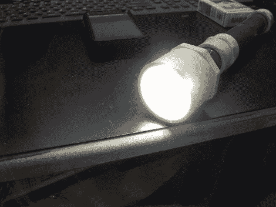

# 通过制作定制手电筒回收锂电池

> 原文：<https://hackaday.com/2012/05/14/recycle-lithium-cells-by-building-custom-flashlights/>

这不是世界上最亮的手电筒(但它确实能达到 1000 流明)。[斯蒂芬·韦伯]正在通过制作他自己的简单 LED 手电筒来寻找剩余零件的用途。如你所见，他使用任何五金店或家庭用品店都有的 PVC 零件。这些都是不错的选择；它们便宜，重量轻，有弹性，设计成防水的，它们很容易螺纹连接在一起，并且具有减小配件直径的连接器。

电子设备使用标准尺寸的圆柱形锂电池。许多类型的笔记本电脑和电动工具电池中都含有这种物质。通常，当其中一个电池组损坏时，这是一个或多个坏电池的问题。[Stephen]拆下电池，在这个项目中重新利用好的电池。

我们没有看到任何关于充电技术的提及。如果这些电池不是原来的电源组形式，谁有什么建议可以把它们装满吗？