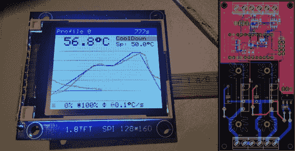

# 带图形 LCD 的回流焊炉控制器

> 原文：<https://hackaday.com/2014/06/16/reflow-oven-controller-with-graphic-lcd/>

回流焊炉是你拥有的最有用的工具之一，如果你还没有建造一个，现在是最好的时机。基于 Arduino 的回流炉控制器配有图形 LCD，是我们见过的最好的回流控制器之一。

拥有回流焊炉开启了一个无限可能的世界。所有这些不可能焊接的表面贴装器件现在比以往任何时候都容易。围绕 [Arduino Pro Micro](https://www.sparkfun.com/products/12640) 和 [Adafruit TFT 彩色 LCD](http://www.adafruit.com/products/358) 构建，这个项目非常直接。你可以自己制作控制器 PCB，也可以使用[0xPIT 的]设计。他的设计是围绕两个固态继电器构建的，一个用于加热元件，一个用于对流风扇。"软件使用 [PID 控制](http://en.wikipedia.org/wiki/PID_controller)加热器和风扇输出，以提高温度稳定性."github 上也有关于该项目的文章，所以请务必向下滚动并查看自述文件。

你所需要做的就是建造[激光](http://hackaday.com/2013/04/03/homebuilt-laser-cutter-ideas/)切割机[和](http://hackaday.com/2013/05/01/diy-laser-cutter-built-to-make-stencils/)[拾取](http://hackaday.com/2014/03/13/manual-pick-and-place/)和[放置](http://hackaday.com/2014/03/23/humble-beginnings-of-a-pick-and-place-machine/)机器[特色](http://hackaday.com/2014/06/12/3d-printed-trays-for-your-pick-and-place-machine/)，你也可以拥有一条完整的表面贴装生产线！