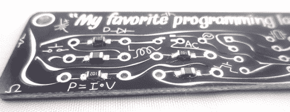

# 用直发器回流

> 原文：<https://hackaday.com/2014/03/30/reflowing-with-a-hair-straightener/>

在这里，回流焊炉通常意味着烤面包机，如果你特别酷，还有热敏电阻和 PID 控制器。当然，有一千种方法可以将锡膏变成牢固的连接，而[萨尔]可能已经找到了最便宜的方法:[一个街头售价仅为 15 英镑的直发器](http://boldport.blogspot.co.uk/2014/03/reflow-with-hair-straightener.html)。

我们不指望大多数黑客对直发器了解多少，但[萨尔]已经做了所有的工作，并提出了一个好的列表。浮板是保持 PCB 始终与加热元件接触的必要条件，温度控制也至关重要。[萨尔]最后买了一个[雷明顿 S3500 陶瓷直发器](http://www.amazon.co.uk/dp/B005BNMWQQ)，尽管去任何一家大商店都可以买到同样好用的直发器。

萨尔增加的一项修改是在一个陶瓷加热元件上贴上一条 Kapton 胶带。它不能替代烤面包机或真正的回流焊炉，但对于小型电路板来说，它同样适用。

下面视频。

[https://www.youtube.com/embed/GNVnfcmQgUY?version=3&rel=1&showsearch=0&showinfo=1&iv_load_policy=1&fs=1&hl=en-US&autohide=2&wmode=transparent](https://www.youtube.com/embed/GNVnfcmQgUY?version=3&rel=1&showsearch=0&showinfo=1&iv_load_policy=1&fs=1&hl=en-US&autohide=2&wmode=transparent)