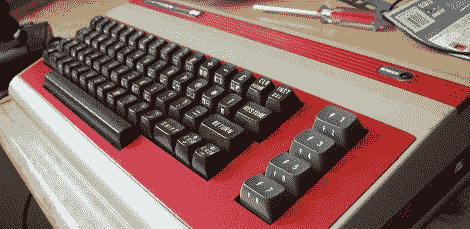

# 用树莓酱翻新 C64

> 原文：<https://hackaday.com/2012/07/09/refurbing-a-c64-with-a-raspberry-pi/>

当[Carl]第一次听说 Raspberry Pi 时，他立刻想到这个主板与迷你 ITX 主板相比是多么的小。在订购了一台 Raspi 之后，[卡尔]决定将他那只比信用卡大不了多少的电脑[放入一台 Commodore 64](http://retrotext.blogspot.co.uk/2012/06/its-complete-post-is-coming-soon.html)中。

[Carl]更新的 C64 功能与原来的完全一样——这款有 30 年历史的键盘得益于一个 [Keyrah 键盘和控制端口适配器](http://www.vesalia.de/e_keyrah.htm)的帮助。这个适配器被焊接到一根剥离的 USB 电缆上，使[Carl]能够保持完成的项目看起来非常干净整洁。当然，复合，HDMI 和以太网端口是分开的，允许这台电脑连接到任何网络或电视。

为了最后的润色，[卡尔]油漆了箱子。他最初想喷上黑色、红色和紫色的图案来搭配 Raspi，但他最终选定了米色和红色的风格。[Carl]真的构建了一个很棒的版本，而且比[重新发布的 C64 Windows 驱动的怪物](http://www.commodoreusa.net/CUSA_C64.aspx)要便宜得多。休息之后，您可以查看构建日志视频。

 [https://www.youtube.com/embed/QnHFO0NRtWs?version=3&rel=1&showsearch=0&showinfo=1&iv_load_policy=1&fs=1&hl=en-US&autohide=2&wmode=transparent](https://www.youtube.com/embed/QnHFO0NRtWs?version=3&rel=1&showsearch=0&showinfo=1&iv_load_policy=1&fs=1&hl=en-US&autohide=2&wmode=transparent)