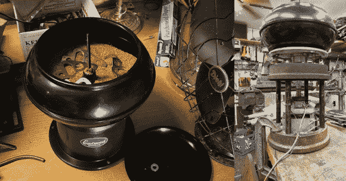

# 用干燥机电机翻新振动滚筒

> 原文：<https://hackaday.com/2014/01/14/refurbishing-a-vibratory-tumbler-with-a-dryer-motor/>

蒸汽朋克工作室的 Jake von Slatt 又来了，这次是翻新一个廉价的振动不倒翁。

最初的伊斯特伍德不倒翁看起来不错，但显然没有在设计它的公司经过多少生命周期测试。拆开后，[杰克]发现马达的轴承在仅仅运行了几个小时后就损坏了！因此，他决定从头开始，只保留碗、盖子，当然还有翻滚的介质。

[Jake 的]重新设计利用了大众汽车制动鼓作为非常重型的底座，一个由废铝制成的定制加工滚珠轴承板，一个通过将一个重型弹簧焊接到两个轴上制成的柔性电机联轴器，一些用于平衡碗的弹簧，以及一个回收的干燥机电机。它可能看起来不漂亮，但我们认为它会比原来的长一点点。

他称之为他的后世界末日工程的最新壮举，仅使用手头的零件，虽然我们不得不同意他对废料的使用令人印象深刻，但我们希望看到他能够在世界末日到来时为他的[重建的布里奇波特工厂](http://hackaday.com/2011/11/13/rebuilding-a-bridgeport-mill/)供电！

像往常一样，他制作了一个描述这个项目的优秀视频——别忘了休息后看看。

[https://www.youtube.com/embed/0M9YYevj5Yc?version=3&rel=1&showsearch=0&showinfo=1&iv_load_policy=1&fs=1&hl=en-US&autohide=2&wmode=transparent](https://www.youtube.com/embed/0M9YYevj5Yc?version=3&rel=1&showsearch=0&showinfo=1&iv_load_policy=1&fs=1&hl=en-US&autohide=2&wmode=transparent)