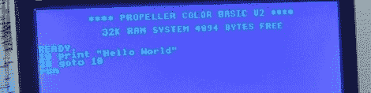

# 用螺旋桨缓解 bbs 的日子

> 原文：<https://hackaday.com/2012/08/20/reliving-the-bbs-days-with-a-propeller/>

在万维网出现之前，自称为极客的人会通过拨入公告牌系统来启动我们的计算机。在其全盛时期，这些 BBS 充满了有趣的人和 warez 填补了最大的 10 兆字节硬盘驱动器。为了重温永恒的九月之前的互联网时代，[杰夫·莱杰] [匆忙制作了一个用升级版经典电脑拨打 BBSes](http://www.instructables.com/id/Calling-Bulletin-Board-Systems-BBS/) 的教程。

[杰夫]没有用 C64 或 Apple II 做这个教程，而是用他设计的螺旋桨驱动的袖珍迷你电脑。这台电脑的特点是在一个八核视差推进器内有 32Kb 的内存，以及一个基本的解释器来运行你自己的程序。

这台迷你电脑可以连接到 BBS 系统，但鉴于目前声学耦合调制解调器非常少见，[Jeff]认为使用他的桌面作为推进器和互联网之间的桥梁，登录到许多互联网连接的 BBS 服务器将是一个好主意。

在[杰夫]让他的螺旋桨电脑在 BBS 上运行后，他可以自由地玩*贸易战*或在许多仍在运行的 mud 中的一个中杀死 grues。对于过去的互联网演示来说，这已经不错了，而且由于使用了推进器，它变得更好了。