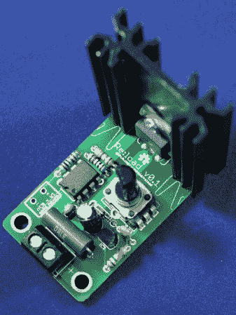

# Re:load，一个开源的虚拟负载

> 原文：<https://hackaday.com/2013/02/06/reload-an-open-source-dummy-load/>

测试电源或 led 时，需要恒流假负载。无论输入端的电压如何，这些器件都会消耗恒定的电流。

[Nick]正在寻找一个负载来测试电源，发现商用产品太大、太强，最重要的是太贵。这导致了他的开源替代方案 [Re:load](http://www.arachnidlabs.com/blog/2013/02/05/introducing-re-load/ "Re:load") 的设计。

像其他恒流源一样，Re:load 使用运算放大器来控制传输元件。虽然大多数恒流负载将只使用晶体管，但[Nick]选择了 BTS117 智能低端开关 IC。该器件内置限流器、过压保护、过温保护和短路保护，使其更加安全。项目报告详细介绍了该设备的工作原理。

如果你需要一个恒定的电流负载，[尼克]在 [Tindie](https://tindie.com/shops/arachnidlabs/reload-the-simple-robust-affordable-dummy-load/ "Tindie") 上卖套件。所有的设计文件都可以在 [Github](https://github.com/arachnid/reload "Re:load on Github") 上找到，这样你就可以自己构建了。