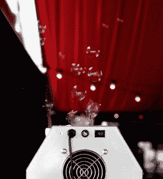

# 记住未来 SXSW 上看到的科幻小说技术

> 原文：<https://hackaday.com/2014/03/15/remembering-the-future-scifi-novel-tech-seen-at-sxsw/>

[https://www.youtube.com/embed/RcEHrlgn9YQ?version=3&rel=1&showsearch=0&showinfo=1&iv_load_policy=1&fs=1&hl=en-US&autohide=2&wmode=transparent](https://www.youtube.com/embed/RcEHrlgn9YQ?version=3&rel=1&showsearch=0&showinfo=1&iv_load_policy=1&fs=1&hl=en-US&autohide=2&wmode=transparent)

还记得未来是游戏机牛仔们在网络空间里跑来跑去试图把对方的脑袋炸出来的日子吗？麻省理工学院媒体实验室也记得。他们有一门名为 [MAS S65:科幻小说到科学制造](http://scifi2scifab.media.mit.edu/)的课程，学生们正在试图创造出受威廉·吉布森、尼尔·斯蒂芬森等传奇投机小说作家作品中想象的技术启发的硬件。他们碰巧在今年的 SXSW 上展示了他们的学生正在做的一些项目。既然[我们在](http://hackaday.com/2014/03/12/the-future-doesnt-need-another-internet-connected-teddybear-hackaday-at-sxsw-create/)附近，我们想我们应该去拜访一下他们。15 分钟后，很明显为什么在媒体实验室工作是那么多黑客/制造者的梦想。

来自媒体实验室的 Jon Ferguson 向我们展示了一款名为[凯斯和莫莉](http://scifi2scifab.media.mit.edu/2013/10/04/case-and-molly-a-game-inspired-by-neuromancer/)的游戏原型，其灵感来自于《T4》*神经癌* 中的场景，凯斯通过密封在莫莉眼眶中的视觉增强镜片观察世界，从而帮助莫莉导航。好吧，他们还没有真正制造出外科手术式的联网镜片(目前还没有)..我们确信[【Ben Krasnow】正在研究它](http://hackaday.com/2011/12/20/ben-krasnow-sticks-leds-in-his-contacts-just-for-kicks/))，但他们已经建立了一个非常酷的 snap-on 3D 视觉机制，可以连接到内置的 iPhone 摄像头。添加一点现场视频流，一个拥有 Oculus Rift 和游戏控制器的人，你就可以像在 1984 年一样聚会。

 另一个有趣的项目叫做“曼陀罗:我正在建造 E14”，它使用从麻省理工学院 E14 的传感器网络收集的数据，以便从单个建筑物的角度提供宇宙的视图。它试图解决一个古老的问题“如果建筑物会说话会怎么样？”通过可视化人们在建筑物周围行走的路径来提问，并提供不同区域活动的总体感觉。这也是一个很好的演示，展示了所有令人毛骨悚然的东西，这些东西都将通过我们使用的所有“连接设备”来建造。

 天气变好了。[感官小说](http://scifi2scifab.media.mit.edu/2013/12/19/sensory-fiction/)项目是一本特殊的书，它带有一件背心，通过提供刺激来增强读者的体验，使读者体验到与书中人物相同的生理情绪。你必须穿上的可穿戴设备支持一系列输出:光、声音、温度、压力和振动，这些都会影响你的心率。很容易想象这种设备有如此多潜在的“创造性”滥用。

 另一个受神经癌启发的作品，叫做 LIMBO(别人运动的肢体)，可以使用一种特殊的电动肌肉刺激装置，通过网络在多个“用户”之间同步手势。结果是一种“肉傀儡”——一个人的手被迫配合另一个人的动作。撇开不正当的想法不谈，它在使用眼球追踪帮助截瘫患者控制肌肉运动方面有很大的潜力。

 最后，一个更令人愉快的项目叫做 [BubbleSynth](http://nextsound.co/bubblesynth-reinvents-pop-music/) 展示了一个开放的计算机视觉/声音合成平台，使用物理过程作为颗粒合成的输入。目前的装置是基于一个气泡发生器和运动跟踪作为一个模块化合成器的触发器，从而产生美丽的环境声音。平台的音频部分基于 [SuperCollider](http://supercollider.sourceforge.net/) ，完全可定制。这个项目的下一步将是利用一种细菌的运动来产生音乐。为什么要努力学习乐器呢？我们会让细菌做所有的工作。

想做类似的东西吗？Hackaday 目前的[科幻竞赛](http://hackaday.io/page/276)是一个完美的借口。需要灵感？查看麻省理工学院 SciFi2SciFab 课程的[教学大纲](http://scifi2scifab.media.mit.edu/syllabus-3/)！