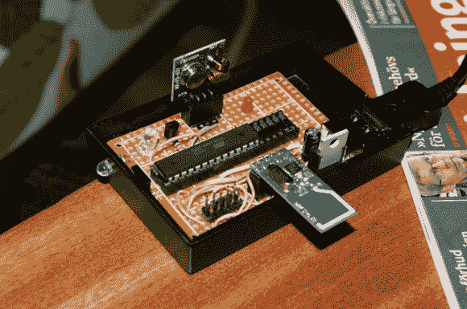

# 遥控指挥中心包括射频和红外功能

> 原文：<https://hackaday.com/2013/03/21/remote-control-command-center-includes-rf-and-ir-functions/>

我们仍然不太确定如何称呼这些项目，但是正如我们之前所说的，很高兴看到人们正在做什么来使用一个遥控器来统治他们。[卡勒·勒夫格伦]正在开发的项目旨在通过将所有控制整合到一个智能手机应用程序中，来简化家中的遥控项目。该系统的关键是这个命令中心，[让智能手机向各种设备发送红外和射频命令](http://gizmosnack.blogspot.se/2013/03/varldens-nordigaste-multifjarrkontroll.html) ( [翻译](http://translate.google.com/translate?sl=auto&tl=en&js=n&prev=_t&hl=en&ie=UTF-8&eotf=1&u=http%3A%2F%2Fgizmosnack.blogspot.se%2F2013%2F03%2Fvarldens-nordigaste-multifjarrkontroll.html))。

我们已经看到这是用非常强大的微控制器完成的，比如这个项目使用了 PIC32 。但是智能手机和基站之间的通信非常简单，就像被转发的遥控命令一样。因此，当我们发现这种设置仅使用 ATmega88、红外 LED、蓝牙模块和射频模块时，我们并不感到惊讶。没有与电脑的连接(USB 只是通过手机充电器供电)。如果你对[卡勒]如何嗅探每个遥控器的协议感兴趣，你可以在上面链接的文章中找到他写的另外两篇文章。