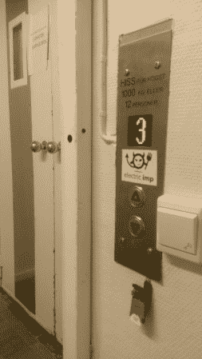

# 用于电梯的遥控器

> 原文：<https://hackaday.com/2014/10/15/remote-control-for-an-elevator/>

[Alex]办公大楼的电梯有些古怪，给大楼里的每个人都带来了不便。主要问题是每层楼的电梯门都是锁着的，直到有人走到大厅按下按钮。显然这是一个麻烦，所以[亚历克斯]建造了一个控制器，可以远程呼叫和解锁电梯。([项目的第二部分](http://evothings.com/how-to-make-an-app-for-remote-controlling-an-elevator-part-2/)位于单独的页面上。)

第一步是寻找硬件来源，弄清楚电梯的控制是如何工作的。[Alex]决定在这个项目中使用电动 Imp，在将其连接到互联网后，他意识到他可以直接从电梯的 10V 电源供电。在那里，他使用继电器将电动 Imp 与电梯控制面板内的“电梯呼叫”和“电梯解锁”按钮连接起来。

一旦硬件方面完成了，就该转向软件方面了。[Alex]为一个可以从任何地方访问的用户界面编写了一个移动应用程序，还编写了电动 Imp 代理的代码和在电动 Imp 本身上运行的代码。现在，只需在移动设备上轻按一个按钮，就足以呼叫电梯或解锁电梯，而不是像过去那样，需要有人跑到大厅去按按钮。

我们希望手机 app 上有一定的安全性，否则世界上任何人都可以叫电梯，把它变成[没有乘客的无用机器](http://hackaday.com/2012/10/18/most-useless-machine-building-elevator-edition/)！