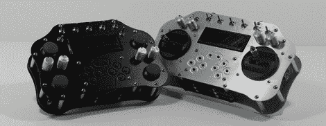

# 用 XBee 和螺旋桨遥控

> 原文：<https://hackaday.com/2012/07/11/remote-control-with-an-xbee-and-a-propeller/>

如果你玩电子产品的时间够长了，最终你会需要一个漂亮的遥控发射器来控制你的遥控汽车、飞机或你周围的任何其他机器人项目。随着这些机器人项目而来的是远程控制的问题，而 [XBee 手持控制器](http://www.kickstarter.com/projects/1757054094/xbee-handheld-controller)可能就是远程控制你工作台上任何项目的门票。

这不是我们看到的第一个[可以做几乎所有事情](http://hackaday.com/2011/07/19/rc-transmitter-does-everything/)的遥控器，但它是第一个包含 XBee 无线收发器的遥控器，可以轻松地与您的机器人项目接口。控制器有两种型号，Q4 使用四个类似 Playstation 的操纵杆，Q2 使用适当的遥控万向操纵杆。两个控制器都有一系列按钮、拨动开关、四个旋转锅和一个 2×20 LCD 显示器。

休息之后，您可以查看[Paul]的介绍，他解释了这些控制器可以做什么，并展示了在他的 Q4 控制器控制下的六足机器人。这是一个非常好的项目，我们迫不及待地想看到这个控制器投入使用。

[https://www.youtube.com/embed/BSsC_mi9BPQ?version=3&rel=1&showsearch=0&showinfo=1&iv_load_policy=1&fs=1&hl=en-US&autohide=2&wmode=transparent](https://www.youtube.com/embed/BSsC_mi9BPQ?version=3&rel=1&showsearch=0&showinfo=1&iv_load_policy=1&fs=1&hl=en-US&autohide=2&wmode=transparent)