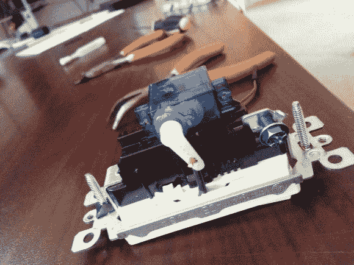

# 远程伺服控制灯开关

> 原文：<https://hackaday.com/2013/10/06/remote-servo-controlled-lightswitch/>

我们经常得到家庭自动化的提示，其中许多都有简单的基于电路的灯开/关控制。然而，保罗·博尔赫斯用他的嵌入式伺服控制电灯开关创造了一些完全不同的东西。这种结构不需要任何继电器来切换电源，因为它是物理地拨动你的开关，所以比其他需要电话或平板电脑接口的结构有明显的优势:你可以像平常一样使用你的开关。

[Paulo]在当地的五金店买了一个摇杆式开关，小心地撬开大而平的开关板，在支点处挖了一个小洞。然后，他小心翼翼地将一根 12 号线做成一定形状，为伺服系统提供一个支点。他在这里选择使用电线似乎完全是为了提供一个坚固而可弯曲的组件，它的功能是机械的，而不是电气的。一个小的 9G 伺服机构安装在开关外壳的背面，伺服机构的臂连接到先前连接的 12 号线。他用一个便宜的来自易贝的 433mhz 代码复制器[和一个](http://www.ebay.com/itm/Cloning-Clone-Learning-Copy-Duplicator-433MHZ-RF-Remote-Control-Transmitter-ssS-/400582525812?pt=Garage_Doors_Openers&hash=item5d44944374) [RF 链接套件](http://www.seeedstudio.com/depot/433mhz-rf-link-kit-p-127.html)拼凑了远程控制功能。

[Paulo]解释说，他的说明只是一个概述，而不是一步一步的指导，所以如果你急于重现这种技巧，你必须自己编写代码和远程控制部分。他也承认还有一个最大的障碍:在墙上找到空间来放置所有的微控制器。休息之后，看看开关的几个视频，记住，总有一个选项[去掉所有的灯开关](http://hackaday.com/2012/07/04/robbs-house-has-no-light-switches/)。

[https://www.youtube.com/embed/W9WE7oo1avc?version=3&rel=1&showsearch=0&showinfo=1&iv_load_policy=1&fs=1&hl=en-US&autohide=2&wmode=transparent](https://www.youtube.com/embed/W9WE7oo1avc?version=3&rel=1&showsearch=0&showinfo=1&iv_load_policy=1&fs=1&hl=en-US&autohide=2&wmode=transparent)

[https://www.youtube.com/embed/W4Jo-eLVllI?version=3&rel=1&showsearch=0&showinfo=1&iv_load_policy=1&fs=1&hl=en-US&autohide=2&wmode=transparent](https://www.youtube.com/embed/W4Jo-eLVllI?version=3&rel=1&showsearch=0&showinfo=1&iv_load_policy=1&fs=1&hl=en-US&autohide=2&wmode=transparent)