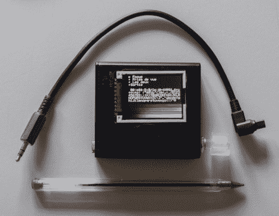

# 遥控快门模块使用液晶屏进行设置

> 原文：<https://hackaday.com/2012/05/30/remote-shutter-module-uses-lcd-screen-for-setup/>

下面是【Pixel-K】刚刚完成的一个[全功能遥控快门项目](http://www.knackes.com/blog/index.php/2012/05/minicom-an-arduino-lcd-dslr-remote-control-en-anglais/)。他似乎对拍摄宇宙的延时照片感兴趣。由于天体摄影发生在晚上，这提出了一些特殊的设计考虑。他想要一种可以在黑暗中配置的东西，而不会过多地破坏他的夜视能力。他还希望戴上一副手套就能轻松配置。

项目外壳是一个 4x AA 电池盒。他拆除了每个牢房之间的隔板，为内脏留出了足够的空间。在里面你会发现一个锂电池和一个微型 USB 充电器板。它为 Arduino mini pro 供电，Arduino mini pro 驱动 1.8 英寸 LCD 屏幕，并驱动负责触发相机的光隔离器。在右边，你可以看到可点击旋转编码器的透明旋钮。所有的用户设置都是通过这个旋钮来选择的。

他已经尝试了 6 个小时的拍摄，没有电池寿命问题或其他问题。