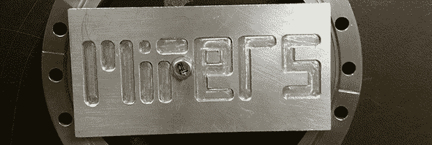

# 修理一个和汽车一样贵的磨坊

> 原文：<https://hackaday.com/2013/08/08/repairing-a-mill-that-cost-as-much-as-a-car/>

几年前，麻省理工学院生物仪器实验室的某人需要为一台三轴研磨机更换控制器中的 CMOS 电池。这重置了机器的 BIOS，被广泛认为是一个糟糕的举动。在[伊恩·亨特]教授把它捐赠给麻省理工学院的学生商店 MITERS 之前，这个磨在实验室里放了几年。因此，修理一台价格相当于一辆汽车的机器的任务落在了一群勇敢的学生身上。

机器——Dyna-Myte 1007 有一个 10″×7″×10″的工作区、气动换刀装置和旋转台，以及第四轴的加工。确实是。然而，在一台运行 DOS 的老式奔腾计算机的驱动下，它拥有 ISA 插槽和 IRQ 带来的所有乐趣。

MITERS 开始了他们的修复工作，在软件配置中挖掘，发现轴驱动是通过 IRQ 3 控制的，而 IRQ 3 目前被 COM 2 占用。在 BIOS 中改变这一点，让计算机控制轴，用几个螺线管和一个空气压缩机，工具转盘也可以工作。

经过一番挖掘，MITERS 还让主轴工作起来，免费给了他们一台非常棒、非常昂贵的数控铣床。即使这台电脑可以被一个 35 美元的树莓派取代，我们真的不得不佩服米特夫妇修好了他们已经有的东西；这是让他们的新玩具运转起来的更便宜、更快的方法。

[https://www.youtube.com/embed/nlc5mpAHTmQ?version=3&rel=1&showsearch=0&showinfo=1&iv_load_policy=1&fs=1&hl=en-US&autohide=2&wmode=transparent](https://www.youtube.com/embed/nlc5mpAHTmQ?version=3&rel=1&showsearch=0&showinfo=1&iv_load_policy=1&fs=1&hl=en-US&autohide=2&wmode=transparent)