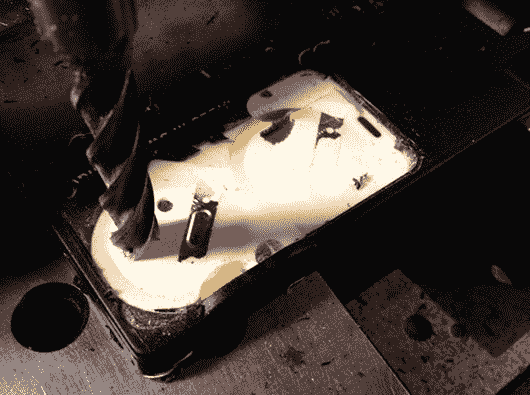

# 修理不可维修的焊接罩

> 原文：<https://hackaday.com/2013/12/23/repairing-a-non-serviceable-welding-hood/>

[Unixgeek]拥有一个 Optrel 焊接罩，其中包含一个可以自动调整各种焊接任务的镜头。它停止了正常工作，这个发动机罩是“不可维修的”，所以他不得不要么扔掉它，要么砍了它。问题是他知道里面有电池，但却拿不到。使用他的铣床，他能够自己修理它。去掉塑料外层后【Unixgeek】发现里面填充了泡沫。继续磨着，他终于揭开了电池。它们是标准的 CR2330 电池，所以他可以很容易地更换它们，或者设置一个单独的电池座。

我们喜欢看到这种黑客行为，尽管很简单，因为我们真的很讨厌内置有计划淘汰功能的设备。这是一个[>](https://www.google.com/search?q=optrel+satellite&oq=optrel+satellite#q=optrel+satellite&safe=off&tbm=shop)价值 300 美元的安全装置，当一些硬币电池最终死亡时，它就会坏掉。任何针对[的黑客行为都可以让人们不必扔掉他们的设备](http://www.reddit.com/r/Welding/comments/1tc0nf/how_to_repair_your_optrel_satellite/ce6fp6q)是一件好事。

你有最喜欢的计划淘汰黑客吗？分享到评论里吧！