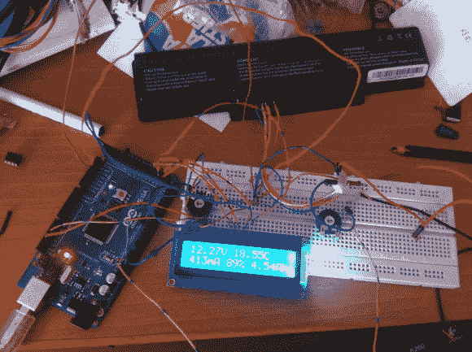

# 改变用途的笔记本电脑电池

> 原文：<https://hackaday.com/2014/08/03/repurposed-laptop-batteries-with-a-twist/>

如今，锂离子电池变得越来越普遍，但一些大容量电池仍然价格不菲。在网上找到宏碁的主板原理图并做了一点逆向工程后，[Tiziano]找到了从他的报废笔记本电脑中回收电池的方法[，不仅节省了垃圾填埋场的电池，还降低了未来项目的成本。](http://linuxehacking.blogspot.it/2014/03/recharging-and-reusing-acer-laptop.html)

这些类型的电池在过去已经被用于许多事情，但这个项目的不同之处在于，[Tiziano]能够监控电池的状态，并使用 Arduino 和独立电源的 I2C 为电池充电，将电池从现在无用的笔记本电脑中解放出来。

有了微控制器和电池组之间的这种级别的通信，当它们在另一个项目中使用时，电池着火的可能性很小。由于 Arduino 还可以监控电池的当前电量，因此也降低了电池因充电不足或充电过度而损坏的风险。

这不仅仅是把电源的正负极接到电池上那么简单。[Tiziano]还必须模拟电池期望看到的主板内阻，并获得恰到好处的电源电压，以便电池的安全协议不会阻止它们充电。在跳过了其他几个障碍后，[Tiziano]现在拥有了一个大容量锂离子电池，可用于任何未来的项目。