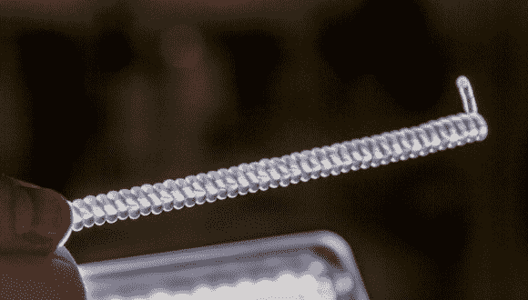

# 研究人员创造出比真肌肉强 100 倍的人造肌肉

> 原文：<https://hackaday.com/2014/02/21/researchers-create-synthetic-muscle-100-times-stronger-than-the-real-thing/>

达拉斯德克萨斯大学的一组研究人员想出了一种制造低成本、高强度人造肌肉的巧妙方法。他们的秘密？钓鱼线。这项研究今天刚刚发表在科学杂志上，最精彩的部分是他们描述了如何在家里重现它。

为了创造它，研究人员使用普通的钓鱼线(聚乙烯或尼龙线)并在张力下扭曲它，直到它卷曲成一个紧密形成的弹簧。然后可以对其进行温度处理以锁定在该位置。

当再次加热时，塑料试图解开——奇怪的是，这导致整个线圈压缩——把它想象成中国的手指陷阱。聚乙烯和尼龙分子受热时也会纵向收缩。它可以收缩 49%左右，拉力相当于人类同等重量肌肉的 100 倍。这相当于每公斤肌肉重量大约 5.3 千瓦的机械功——类似于喷气式发动机的输出。

留下来看看如何制作视频——我们很高兴看到你们对项目应用的想法！

[https://www.youtube.com/embed/1A2LUbJjDQ0?version=3&rel=1&showsearch=0&showinfo=1&iv_load_policy=1&fs=1&hl=en-US&autohide=2&wmode=transparent](https://www.youtube.com/embed/1A2LUbJjDQ0?version=3&rel=1&showsearch=0&showinfo=1&iv_load_policy=1&fs=1&hl=en-US&autohide=2&wmode=transparent)

[via [大众力学](http://www.popularmechanics.com/science/health/breakthroughs/synthetic-muscle-made-of-fishing-line-is-100-times-stronger-than-the-real-thing-16514805)