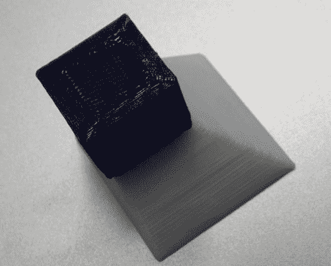

# 重新开始 3D 打印

> 原文：<https://hackaday.com/2014/08/02/restarting-3d-prints/>

如果 3D 打印机在打印过程中中断，通常会产生垃圾零件。恢复打印可能非常困难。麻省理工学院的一组研究人员已经为 3D 打印机开发了一个插件[，它使用激光扫描仪来评估打印状态，并允许打印机重新启动。](http://3dprintingindustry.com/2014/07/30/mit-creates-smart-3d-printer-capable-detecting-restarting-interrupted-prints/)

虽然这将允许您挽救一些部分完成的打印，有趣的应用程序是在材料之间切换。在上图中，下半部分是用 ABS 印刷的。打印中断换材料，最上面的立方体用 PLA 打印。这使得印刷品可以混合材料和颜色。

这款附加产品已经过 Solidoodle 3D 打印机的测试，售价约为 60 美元。它需要一个安装在打印头上的激光器和一个低成本的网络摄像头来进行测量。虽然该小组不会继续这个项目的工作，但他们计划将他们的工作开源，这样其他人就可以继续他们停止的工作。

休息之后，我们有一个打印机执行扫描和恢复打印的视频。

[https://www.youtube.com/embed/52QecCxiNOY?version=3&rel=1&showsearch=0&showinfo=1&iv_load_policy=1&fs=1&hl=en-US&autohide=2&wmode=transparent](https://www.youtube.com/embed/52QecCxiNOY?version=3&rel=1&showsearch=0&showinfo=1&iv_load_policy=1&fs=1&hl=en-US&autohide=2&wmode=transparent)