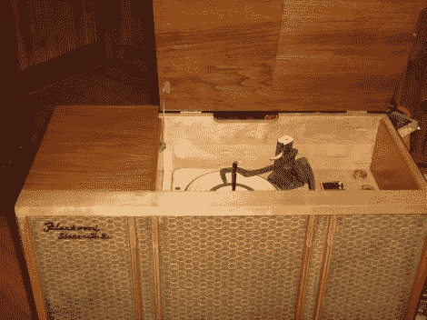

# 复活高保真音箱

> 原文：<https://hackaday.com/2012/07/07/resurrecting-a-hi-fi-cabinet/>

[VintagePC]把这个旧音响从谷仓里拿出来。它破旧不堪，但他设法让它重新运转起来，并让它看起来也很棒。

虽然它受到了保护，不受自然环境的影响，但却没有受到啮齿动物的侵害。老鼠咬穿了纤维板背衬，在里面建了一个漂亮的家。他提到他们咬坏了控制调音盘的弦，我们确信他们也是其他问题的原因。他给出了明智的建议，即在你有机会评估情况之前，不要打开像这样的旧电视机。

放大器的内部就像我们上次看的收音机修理一样混乱。但在仔细研究电路，根据需要更换电容和电阻后，他开始取得一些进展。接收器线圈需要重绕，为此他用了一个旧 CRT 显示器上的电线。环形天线被重新装上，电唱机的手臂被装上了一个新的弹药筒，并用一个巧妙的乐高装置来平衡。一些贴面工作和木材加工使表壳本身恢复了其原有的美感。我们会说努力工作是非常值得的。他有一件让他永远引以为豪的大家具！