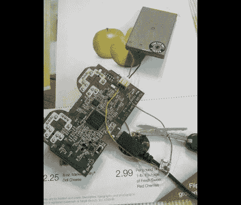

# 复活一个不充电的 PS3 控制器

> 原文：<https://hackaday.com/2012/06/28/resurrecting-a-ps3-controller-that-wont-charge/>

【SJM4306】从一家快倒闭的游戏店抢了一台二手的 PlayStation 3。他得到了一笔相当不错的交易，这显然是多年来的地板模型。一个真正的问题是随之而来的控制器。这东西太脏了，他甚至用手套来拆卸和消毒。在那之后，它工作得很好，直到他发现它不能像它应该的那样从 USB 端口充电。但是他设法用自己的 T1 替换了充电电路。

当清洁控制器内部时，他发现有许多污泥沉积物，他将其归因于溢出的苏打。这一定损坏了负责充电的一个芯片，因为他探测的是不稳定的 2V 电压，而不是应该通过 USB 线路输入的规定的 5V 电压。他的解决方案是将 USB 端口脱焊，以便将其 5V 引脚与 PCB 分离。然后，他蚀刻了一个小电路板，以容纳 MAX1555 充电 IC。随着新硬件的到位，控制器又开始工作了。