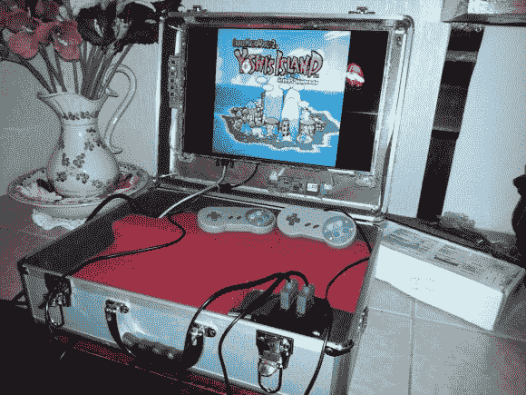

# 复古游戏以防万一

> 原文：<https://hackaday.com/2013/02/21/retro-gaming-just-in-case/>

你可以看啊看，但你不会在这个复古的游戏装备里找到一个超级任天堂。[Webrow]正在让他的老式硬件休息一下，并且无论去哪里都带着[这个一体化游戏模拟器手提箱](http://imgur.com/a/5qval/layout/blog)。

他建造的核心机器当然是树莓派。在成本、功耗和硬件可扩展性方面，你真的无法击败无处不在的主板。一个坏了的笔记本电脑的液晶面板被安装在盖子里。在很长一段时间内，重复使用这些面板是没有希望的，但[Webrow]找到了一个适配器板(价格几乎与 RPi 相同)，它可以将 DVI 从 Pi 转换为屏幕所需的 LVDS。屏幕的连接和安装方案是大部分项目工作完成的地方。连接控制器只需要将一些 SNES 控制器插座焊接到 RPi 分线连接器上。我们不得不称赞他的红色边框，它隐藏了所有的电源线和其他难看的东西。该案件看起来坚固，并准备发挥！