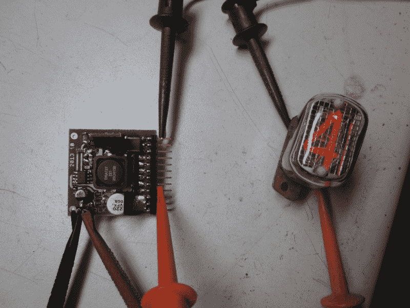

# 复古现代谢妮钟

> 原文：<https://hackaday.com/2014/01/16/retro-modern-nixie-clock/>

是一个谦逊的黑客，他喜欢谢妮电子管。因此，当他在一个义卖会上看到一个旧的通用电池充电器出售时，他想:[“这个盒子可以做一个很好的时钟…”](http://reboots.g-cipher.net/time/)

他第一次接触数码管钟表是在几年前，当时他的哥哥从 TubeClock.com 的彼得·詹森网站给他一个 DIY 的谢妮钟表套件——这是一个简单的制作，而且工作得非常好。它还向他介绍了谢妮电子管的一种独特的驱动器，一种由 Supertex inc .制造的 [HV5622](http://www.supertex.com/pdf/datasheets/HV5622.pdf) 高压移位寄存器。与传统的(也是罕见的)74141 谢妮驱动芯片或分立晶体管驱动器相比，HV5622 要小得多，需要更少的微控制器 I/O，并且在供电时也不那么挑剔。

他为这个项目选择的谢妮管来自易贝的大量销售，俄罗斯剩余的 IN-12 管。他甚至设法为他们找到了一份英文数据表。

决定了数码管、驱动器和外壳后，他现在需要一个可靠的电源。Threeneuron 的设计很好地满足了要求，但是它在负载下会有一点噪音，但是[重新启动]注意到 TubeClock 套件使用了一个自由运行的晶体管振荡器，实际上在负载下噪音更大！

接下来就是测试电子管，制作一些印刷电路板的原型，以及给 ATmega48 编程。简单吧？谢妮症从来没有那么简单。但幸运的是，[Reboots]在他的网站上有一篇令人惊叹的文章，所以如果你有兴趣了解更多，请看一看！

哦，如果你在寻找一个真正独一无二的谢妮钟，为什么不做一个完全没有印刷电路板的呢？不要碰高压线…