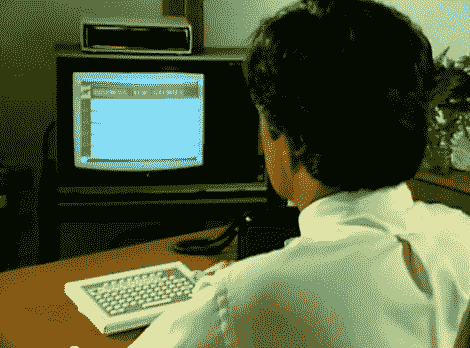

# Retrotechtacular: 1983 年对信息过载的回答

> 原文：<https://hackaday.com/2012/08/21/retrotechtacular-1983s-answer-to-information-overload/>

我们不能说我们真的认为 20 世纪 80 年代早期的问题是人们手中掌握了太多的信息。但是[这个 Sceptre 可视图文终端](http://www.youtube.com/watch?v=sgYkpk9nJnE)的宣传视频宣称它是解决当时信息过载的方案。整个视频在插播之后嵌入。

您将电视用作显示器，将硬件连接到电话线，并使用键盘进行导航。也许我们最喜欢的是播音员告诉我们这个系统背后的秘密是其“巨大的信息来源”。其中包括迈阿密先驱报、美联社、华尔街日报和消费者报告。请记住，那时您需要访问本地图书馆来访问所有这些资源。此外，搜索他们是不可能的。

但是等等，这不仅仅是为了新闻。该系统由 Night-Ridder(一家大型报业集团)和美国电话电报公司支持，拥有商业和银行能力以及教育服务。这是互联网的愿景，马·贝尔更希望今天就能实现。

[https://www.youtube.com/embed/sgYkpk9nJnE?version=3&rel=1&showsearch=0&showinfo=1&iv_load_policy=1&fs=1&hl=en-US&autohide=2&wmode=transparent](https://www.youtube.com/embed/sgYkpk9nJnE?version=3&rel=1&showsearch=0&showinfo=1&iv_load_policy=1&fs=1&hl=en-US&autohide=2&wmode=transparent)

[通过 [Gizmodo](http://gizmodo.com/5907450/atts-1983-solution-for-information-overload-is-retro+futuristic)