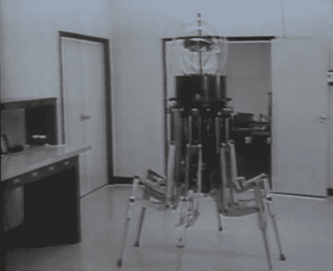

# retro tech atacular:1983 年的步行机器人，名为 ODEX 1 号

> 原文：<https://hackaday.com/2012/12/11/retrotechtacular-a-1983-walking-robot-called-odex-1/>

在这段 1983 年的视频中，ODEX 1 号被称为第一个商业行走机器人。当然你会很快认出这是一只六足动物。很难接受这样一个事实:当时如此先进的[现在可以在国内相对便宜地制造出来。](http://hackaday.com/2012/07/31/a-large-hexapod-made-of-wood-and-pvc-pipe/)

与大多数这些回顾性帖子一样，演示是乐趣的一大部分。视频开头的音轨表达了看到如此先进的机器人走过大楼时的震惊(它正朝我们走来？！).工程师服装的趋势也在展出。ODEX 1 号被誉为在充满梯子和楼梯的环境中机械化旅行的解决方案。显然，它可以穿过楼梯，但你最好准备好等一会儿，让它去任何地方。休息后在视频里自己看吧。

[https://www.youtube.com/embed/EWX9iRw33OE?version=3&rel=1&showsearch=0&showinfo=1&iv_load_policy=1&fs=1&hl=en-US&autohide=2&wmode=transparent](https://www.youtube.com/embed/EWX9iRw33OE?version=3&rel=1&showsearch=0&showinfo=1&iv_load_policy=1&fs=1&hl=en-US&autohide=2&wmode=transparent)