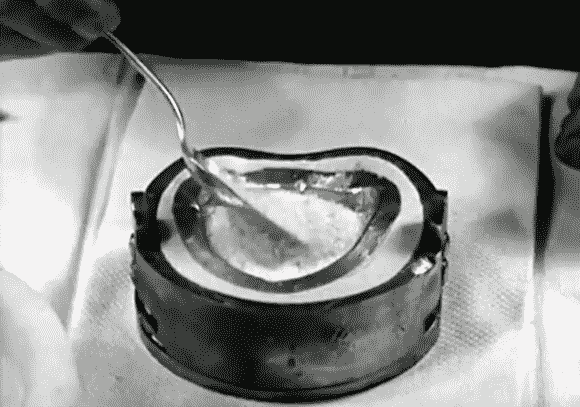

# 技术革新:电木塑料

> 原文：<https://hackaday.com/2014/02/04/retrotechtacular-bakelite-plastics/>

[ColdTurkey]发了一个很棒的视频给这周的回顾展。这是一个半小时的[关于胶木塑料](http://www.youtube.com/watch?v=GlCFBexBWGU)的宣传片。这部电影有太多值得欣赏的地方，但我们一直忽略了它，因为前六分钟左右由一个“化学家”和“记者”之间令人不安的虚假采访组成。他们站得太近，侵犯了*我们的*个人空间。但是忍受或者跳过，剩下的视频就是黄金了。

[胶木](http://en.wikipedia.org/wiki/Bakelite)是一种早期的塑料，置身于那个时代，你很容易看到这些材料的奇迹。上面模制的假牙是由酚醛树脂制成的(对我们来说，这听起来像是你不会放在嘴里的东西，但我们知道什么呢？).当加热时，塑料颗粒会呈现出模具的形状——我们不知道这是这个名字的来源，还是发现这种材料的化学家的名字的变体:[利奥·贝克兰德博士]。这是第一种合成塑料，来得正是时候，因为它被大量用于电子和汽车工业。两者当时都在开拓新的领域。

[https://www.youtube.com/embed/GlCFBexBWGU?version=3&rel=1&showsearch=0&showinfo=1&iv_load_policy=1&fs=1&hl=en-US&autohide=2&wmode=transparent](https://www.youtube.com/embed/GlCFBexBWGU?version=3&rel=1&showsearch=0&showinfo=1&iv_load_policy=1&fs=1&hl=en-US&autohide=2&wmode=transparent)

Retrotechtacular 是一个每周专栏，以旧时的黑客、技术和媚俗为特色。通过[发送您对未来分期付款的想法](mailto:tips@hackaday.com?Subject=[Retrotechtacular])，帮助保持新鲜感。